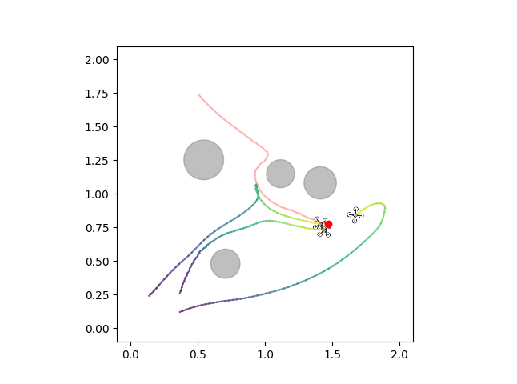

## Key dependencies based (Lower versions are not guaranteed to be feasible):

python: 3.9.0

numpy: 1.26.0

gym: 0.26.2

pillow: 10.2.0

torch: 2.4.0+cu124

torchaudio: 2.4.0+cu124

torchvision: 0.19.0+cu124

## Explanation of Document

- `agent`/`buffer`/`maddpg`/`networks`: Refer to Phil's work -> [PhilMADDPG](https://github.com/philtabor/Multi-Agent-Reinforcement-Learning);

- `sim_env`: Customized Multi-UAV round-up environment;

- `main`: Main loop to train agents;

- `main_evaluate`: Only rendering part is retained in `main`, in order to evaluate models (a set of feasible models is provided in `tmp/maddpg/UAV_Round_up`;

- `math_tool`: some math-relevant functions.

## Star History

